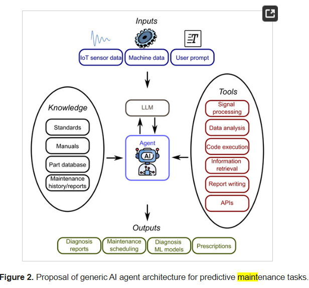

# FaultSense 🪛

### AI-Driven Predictive Maintenance System

FaultSense is an agentic AI system that ingests real-time sensor data, reasons over a maintenance knowledge base, and generates actionable diagnosis reports — built on LangGraph + Mistral.

---

## Architecture

The agent follows a 3-step graph:
1. **Signal Processor** — detects anomalies in sensor readings
2. **RAG Retriever** — queries maintenance manuals via ChromaDB
3. **Report Writer** — synthesizes a structured diagnosis via Mistral

---

## Tech Stack

| Layer | Tool |
|---|---|
| Agent Framework | LangGraph |
| LLM | Mistral API |
| Vector DB | ChromaDB |
| Data | NASA CMAPSS Dataset |
| API | FastAPI |